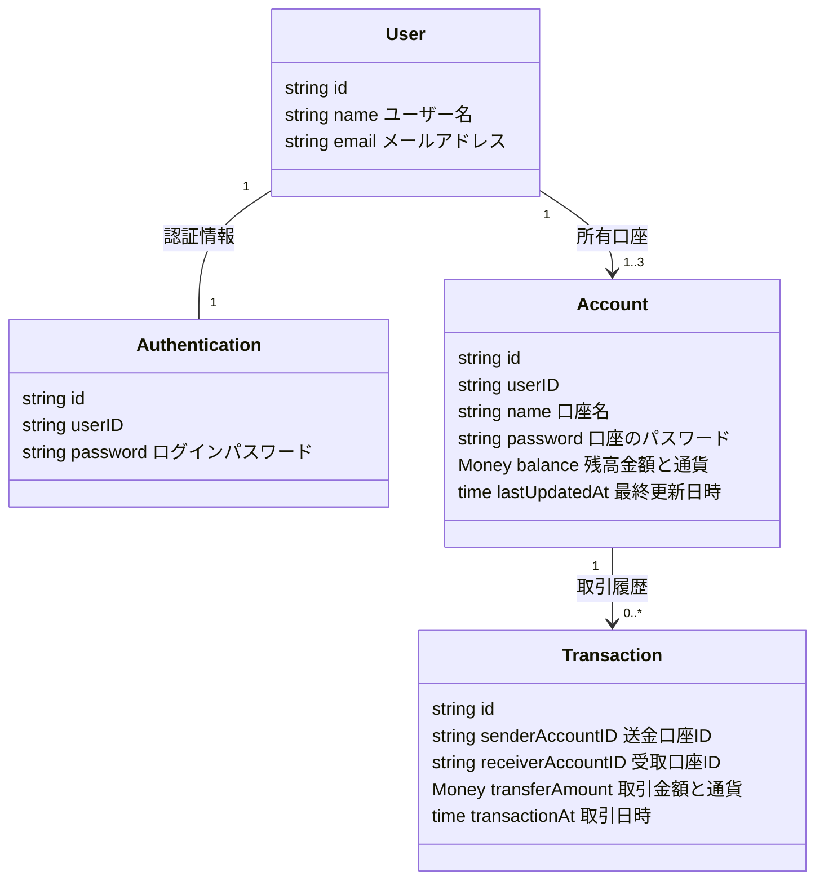

```mermaid
classDiagram
  class User {
    string id
    string name ユーザー名
    string email メールアドレス
  }

  class Authentication {
    string id
    string userID
    string password ログインパスワード
  }

  class Account {
    string id
    string userID
    string name          口座名
    string password      口座のパスワード
    Money  balance       残高金額と通貨
    time   lastUpdatedAt 最終更新日時
  }

  class Transaction {
    string id
    string senderAccountID   送金口座ID
    string receiverAccountID 受取口座ID
    Money  transferAmount    取引金額と通貨
    time   transactionAt     取引日時
  }

  User "1" -- "1" Authentication : 認証情報
  User "1" --> "1..3" Account : 所有口座
  Account "1" --> "0..*" Transaction : 取引履歴
```