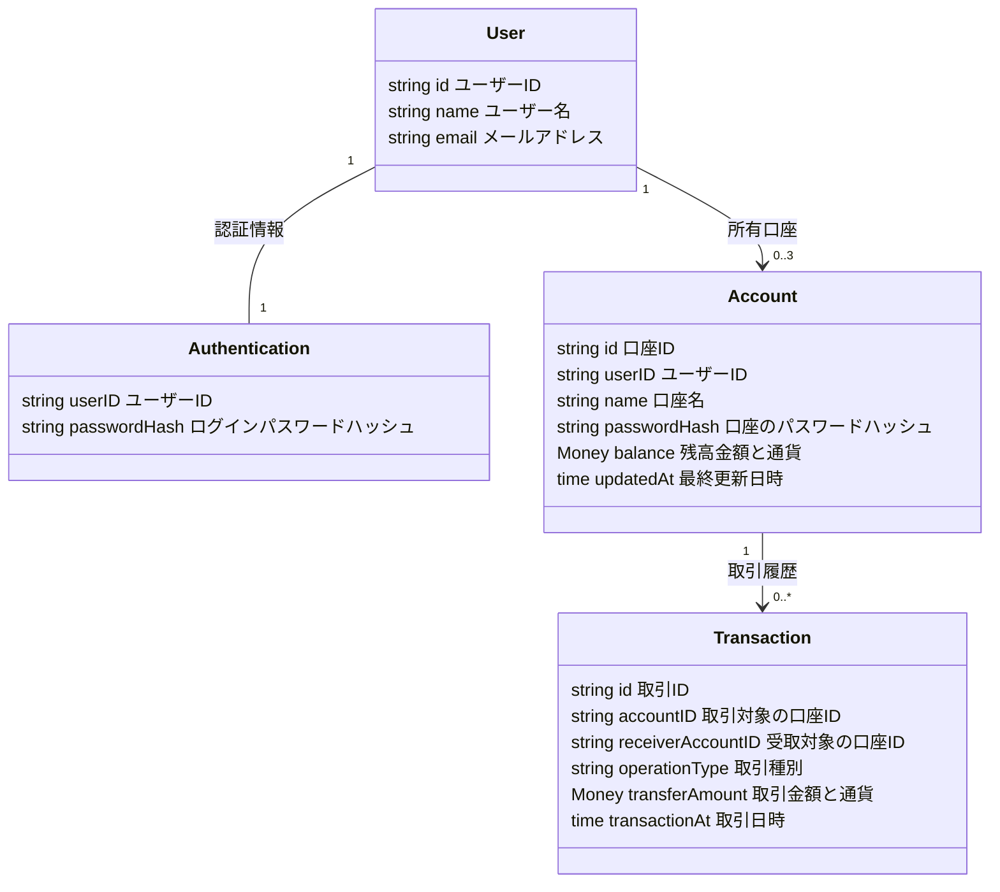

```mermaid
classDiagram
  class User {
    string id ユーザーID
    string name ユーザー名
    string email メールアドレス
  }

  class Authentication {
    string userID ユーザーID
    string passwordHash ログインパスワードハッシュ
  }

  class Account {
    string id 口座ID
    string userID ユーザーID
    string name 口座名
    string passwordHash 口座のパスワードハッシュ
    Money  balance 残高金額と通貨
    time   updatedAt 最終更新日時
  }

  class Transaction {
    string id 取引ID
    string accountID 取引対象の口座ID
    string receiverAccountID 受取対象の口座ID
    string operationType 取引種別
    Money  transferAmount 取引金額と通貨
    time   transactionAt 取引日時
  }

  User "1" -- "1" Authentication : 認証情報
  User "1" --> "0..3" Account : 所有口座
  Account "1" --> "0..*" Transaction : 取引履歴
```