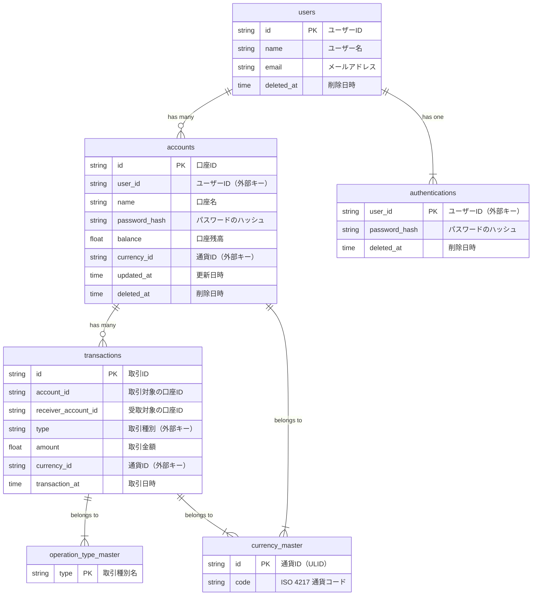

```mermaid
erDiagram
    users {
        string id PK "ユーザーID"
        string name "ユーザー名"
        string email "メールアドレス"
        time deleted_at "削除日時"
    }
    authentications {
        string user_id PK "ユーザーID（外部キー）"
        string password_hash "パスワードのハッシュ"
        time deleted_at "削除日時"
    }
    accounts {
        string id PK "口座ID"
        string user_id "ユーザーID（外部キー）"
        string name "口座名"
        string password_hash "パスワードのハッシュ"
        float balance "口座残高"
        string currency_id "通貨ID（外部キー）"
        time updated_at "更新日時"
        time deleted_at "削除日時"
    }
    transactions {
        string id PK "取引ID"
        string account_id "取引対象の口座ID"
        string receiver_account_id "受取対象の口座ID"
        string type "取引種別（外部キー）"
        float amount "取引金額"
        string currency_id "通貨ID（外部キー）"
        time transaction_at "取引日時"
    }
    currency_master {
        string id PK "通貨ID（ULID）"
        string code "ISO 4217 通貨コード"
    }
    operation_type_master {
        string type PK "取引種別名"
    }

    users ||--o{ accounts : "has many"
    users ||--|{ authentications : "has one"
    accounts ||--o{ transactions : "has many"
    accounts ||--|{ currency_master : "belongs to"
    transactions ||--|{ operation_type_master : "belongs to"
    transactions ||--|{ currency_master : "belongs to"
```