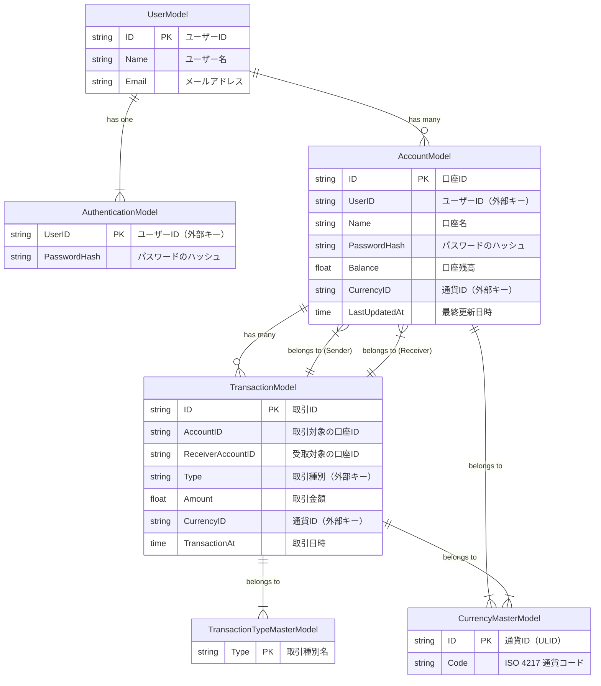

```mermaid
erDiagram
    UserModel {
        string ID PK "ユーザーID"
        string Name "ユーザー名"
        string Email "メールアドレス"
    }
    AuthenticationModel {
        string UserID PK "ユーザーID（外部キー）"
        string PasswordHash "パスワードのハッシュ"
    }
    AccountModel {
        string ID PK "口座ID"
        string UserID "ユーザーID（外部キー）"
        string Name "口座名"
        string PasswordHash "パスワードのハッシュ"
        float Balance "口座残高"
        string CurrencyID "通貨ID（外部キー）"
        time LastUpdatedAt "最終更新日時"
    }
    TransactionModel {
        string ID PK "取引ID"
        string AccountID "取引対象の口座ID"
        string ReceiverAccountID "受取対象の口座ID"
        string Type "取引種別（外部キー）"
        float Amount "取引金額"
        string CurrencyID "通貨ID（外部キー）"
        time TransactionAt "取引日時"
    }
    CurrencyMasterModel {
        string ID PK "通貨ID（ULID）"
        string Code "ISO 4217 通貨コード"
    }
    TransactionTypeMasterModel {
        string Type PK "取引種別名"
    }

    UserModel ||--o{ AccountModel : "has many"
    UserModel ||--|{ AuthenticationModel : "has one"
    AccountModel ||--o{ TransactionModel : "has many"
    AccountModel ||--|{ CurrencyMasterModel : "belongs to"
    TransactionModel ||--|{ TransactionTypeMasterModel : "belongs to"
    TransactionModel ||--|{ AccountModel : "belongs to (Sender)"
    TransactionModel ||--|{ AccountModel : "belongs to (Receiver)"
    TransactionModel ||--|{ CurrencyMasterModel : "belongs to"
```